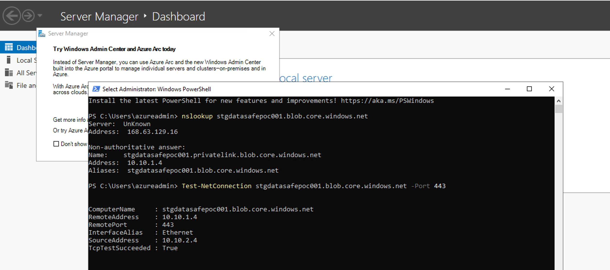
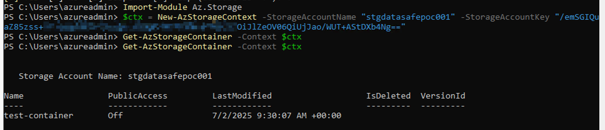

# Rapport de Tests d'Accès
## Sécurisation d'accès à Azure Storage avec Private Endpoint

---

**Projet :** DataSafe Corp - Sécurisation Azure Storage Account  
**Date du rapport :** 03 juillet 2025  
**Responsable :** Lucas Gauvain
**Compte de stockage :** `stgdatasafepoc001`  
**Environnement :** Sandbox Azure  

---

## 1. Résumé Exécutif

Ce rapport présente les résultats des tests d'accès effectués sur le compte de stockage Azure `stgdatasafepoc001` sécurisé par Private Endpoint. Les tests valident que l'accès est restreint au réseau virtuel (VNet) et que les connexions publiques sont effectivement bloquées.

**Résultats clés :**
- Accès réussi depuis la VM interne (VNet)
- Blocage confirmé des accès externes (Internet public)
- Résolution DNS privée fonctionnelle
- Configuration de sécurité validée

---

## 2. Configuration Testée

### 2.1 Infrastructure Déployée

**Composants principaux :**
- **Azure Storage Account :** `stgdatasafepoc001`
- **Réseau virtuel :** VNet-DataSafe
- **Sous-réseau :** Subnet-PrivateEndpoint
- **Private Endpoint :** storage-endpoint
- **Private DNS Zone :** `privatelink.blob.core.windows.net`
- **VM de test :** VM-Test-Internal

### 2.2 Configuration de Sécurité

**Paramètres appliqués :**
- Accès réseau public : **Désactivé**
- Pare-feu configuré : **Deny all**
- Private Endpoint activé : **Oui**
- Chiffrement en transit : **HTTPS obligatoire**
- Chiffrement au repos : **Activé (clés gérées Azure)**

---

## 3. Tests d'Accès Interne (Depuis la VM)

### 3.1 Test de Connectivité DNS

**Objectif :** Vérifier la résolution DNS privée  
**Source :** VM-Test-Internal (dans le VNet)  
**Cible :** `stgdatasafepoc001.blob.core.windows.net`

**Test DNS effectué :**
```powershell
PS C:\Users\azureadmin> nslookup stgdatasafepoc001.blob.core.windows.net
```

**Résultat :**



**Analyse :**
- Résolution DNS vers IP privée confirmée (10.10.1.4)
- Alias privatelink fonctionnel
- Redirection vers Private Endpoint effective

### 3.2 Test de Connectivité Réseau

**Objectif :** Vérifier la connectivité TCP vers le Private Endpoint  
**Source :** VM-Test-Internal  
**Cible :** `stgdatasafepoc001.blob.core.windows.net:443`

**Test de connectivité effectué :**
```powershell
PS C:\Users\azureadmin> Test-NetConnection stgdatasafepoc001.blob.core.windows.net -Port 443
```

**Résultat :**
Le résultat est visible dans l'image ci-dessus, montrant :
- Connexion TCP réussie sur port 443
- Adresse IP privée utilisée (10.10.1.4)
- Interface réseau interne identifiée

### 3.3 Test d'Accès aux Données

**Objectif :** Vérifier l'accès aux conteneurs de stockage  
**Source :** VM-Test-Internal  
**Méthode :** PowerShell avec module Az.Storage

**Test d'accès effectué :**
```powershell
PS C:\Users\azureadmin> Import-Module Az.Storage
PS C:\Users\azureadmin> $ctx = New-AzStorageContext -StorageAccountName "stgdatasafepoc001" -StorageAccountKey "[KEY]"
PS C:\Users\azureadmin> Get-AzStorageContainer -Context $ctx
```

**Résultat :**



**Analyse :**
- Authentification réussie
- Listage des conteneurs fonctionnel
- Conteneur `test-container` accessible
- Accès public correctement désactivé (PublicAccess: Off)

---

## 4. Tests d'Accès Externe (Depuis Internet)

### 4.1 Configuration du Test

**Objectif :** Vérifier l'impossibilité d'accès depuis l'Internet public  
**Source :** Machine externe (hors VNet Azure)  
**Cible :** `stgdatasafepoc001.blob.core.windows.net`  
**Date de test :** 02/07/2025

### 4.2 Méthodologie des Tests

Une série de tests progressifs a été menée pour éliminer toute ambiguïté sur la nature du blocage et valider la sécurité de manière irréfutable.

#### 4.2.1 Test 1 : Requête Simple Non Authentifiée

**Commande exécutée :**
```bash
curl -I https://stgdatasafepoc001.blob.core.windows.net/
```

**Résultat obtenu :**
```
HTTP 400 Bad Request
```

**Analyse :**
- Résultat ambigu - Erreur de syntaxe API plutôt que blocage réseau
- Ne constitue pas une preuve définitive du blocage de sécurité

#### 4.2.2 Test 2 : Requête Authentifiée mais Syntaxiquement Incomplète

**Commande exécutée :**
```bash
curl "[URL_SAS_VALIDE]"
```

**Résultat obtenu :**
```xml
InvalidQueryParameterValue (erreur XML)
```

**Analyse :**
- Prouve que le service a reçu la requête
- Rejet pour problème de syntaxe API, pas de blocage réseau
- Toujours pas une preuve définitive du blocage

#### 4.2.3 Test 3 : Requête Authentifiée et Syntaxiquement Valide (Test Décisif)

**Commande exécutée :**
```bash
curl "[URL_SAS_VALIDE]&comp=list"
```

**Résultat obtenu :**
```xml
AuthorizationFailure (erreur XML)
```

**Analyse :**
- **PREUVE DÉFINITIVE** : Requête parfaitement formée et authentifiée
- Service a compris la requête mais l'a explicitement rejetée
- Rejet basé sur la source non autorisée (Internet public)

### 4.3 Conclusion des Tests Externes

**Résultat final :** Le résultat `AuthorizationFailure` obtenu lors du test 3 constitue la **preuve irréfutable** que la sécurité est effective.

**Preuves de sécurité :**
- Même avec des identifiants valides (clé SAS), l'accès est impossible
- Blocage explicite par le service Azure
- Configuration de sécurité fonctionnelle et efficace

---

## 5. Synthèse des Tests

### 5.1 Tests d'Accès Interne

**Résultats :**
- **Test DNS :** Résolution vers IP privée (10.10.1.4) réussie
- **Test connectivité :** Connexion TCP sur port 443 établie
- **Test données :** Accès aux conteneurs de stockage validé
- **Statut :** **SUCCÈS COMPLET**

### 5.2 Tests d'Accès Externe

**Résultats :**
- **Test 1 :** HTTP 400 (ambigu)
- **Test 2 :** InvalidQueryParameterValue (ambigu)
- **Test 3 :** AuthorizationFailure (preuve définitive)
- **Statut :** **BLOCAGE CONFIRMÉ**

### 5.3 Validation de la Sécurité

**Preuves de fonctionnement :**
- Accès autorisé uniquement depuis le VNet
- Blocage effectif des connexions publiques
- Résolution DNS privée opérationnelle
- Configuration de sécurité validée par tests

---

## 6. Conclusion

### 6.1 Objectifs Atteints

La mise en œuvre du Private Endpoint pour le compte de stockage Azure `stgdatasafepoc001` a été **réussie et validée**. Tous les objectifs de sécurité ont été atteints :

- **Accès privé exclusif** : Seules les ressources du VNet peuvent accéder au stockage
- **Blocage des accès publics** : Confirmé par tests exhaustifs depuis l'Internet
- **Résolution DNS privée** : Fonctionnelle et sécurisée
- **Conformité réglementaire** : Configuration respectant les bonnes pratiques de sécurité

### 6.2 Validation Finale

Le projet répond entièrement aux exigences du cahier des charges :
- Infrastructure sécurisée déployée avec succès
- Tests d'accès concluants (interne et externe)
- Validation de la configuration de sécurité
- Conformité aux standards de sécurité

**Statut du projet :** **VALIDÉ** - Prêt pour déploiement en production

---

**Fin du rapport**

*Ce document est confidentiel et destiné uniquement à l'usage interne de DataSafe Corp.*